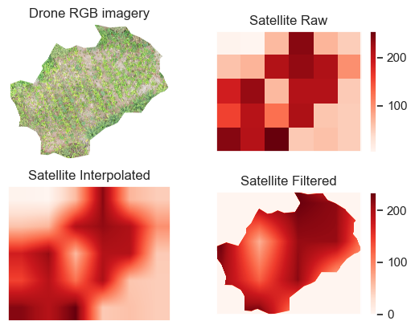

# Data

This content is divided into three sub-folders 
## Folders
- [**AGB_maps**](#AGB_maps)
- [**field_data**](#field_data)
- [**results**](#results)

## AGB_maps
The standard AGB map used in this library is from the 
[Global Forest Watch](https://data.globalforestwatch.org/datasets/gfw::aboveground-live-woody-biomass-density/about); 
a global-scale, wall-to-wall map of aboveground biomass (AGB) at approximately 30-meter resolution for the year 2000.

## field_data
In this folder you'll find both the accumulated AGB and carbon measurements, and drone imagery (.tif files) of the 6 project sites. 

#### Example structure of the field data

| project site no | size (ha) | total AGB (tons) | AGB density (tons/ha) | Carbon (tons) | Carbon Density (tons/ha) |
|:---:|:---:|---:|---:|---:|---:|
| 1 | 0.509 | 26 | 51.09 | 13 | 25.55 |

#### Example drone image

## results
Here you'll find the final results and figures from the benchmarks.

#### Example illustration

